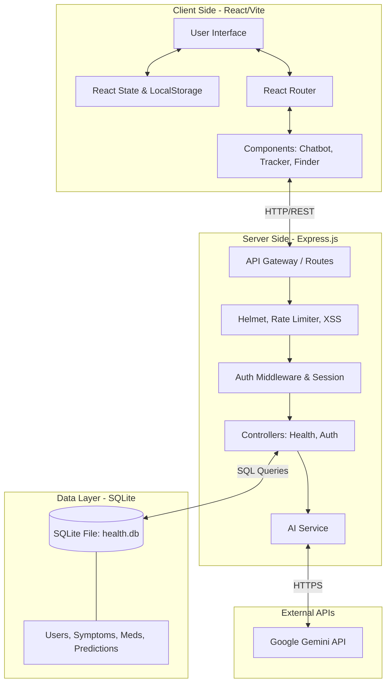

# System Architecture Diagram

```mermaid
graph TD
    subgraph Frontend [Client Side - React/Vite]
        UI[User Interface]
        State[React State & LocalStorage]
        Router[React Router]
        Components[Components: Chatbot, Tracker, Finder]
        
        UI <--> State
        UI <--> Router
        Router <--> Components
    end

    subgraph Backend [Server Side - Express.js]
        API[API Gateway / Routes]
        Auth[Auth Middleware & Session]
        Security[Helmet, Rate Limiter, XSS]
        Controllers[Controllers: Health, Auth]
        Services[AI Service]
        
        API --> Security
        Security --> Auth
        Auth --> Controllers
        Controllers --> Services
    end

    subgraph Database [Data Layer - SQLite]
        DB[(SQLite File: health.db)]
        Tables[Users, Symptoms, Meds, Predictions]
        
        DB --- Tables
    end

    subgraph External [External APIs]
        Gemini[Google Gemini API]
    end

    %% Connections
    Components <-->|HTTP/REST| API
    Controllers <-->|SQL Queries| DB
    Services <-->|HTTPS| Gemini
```
