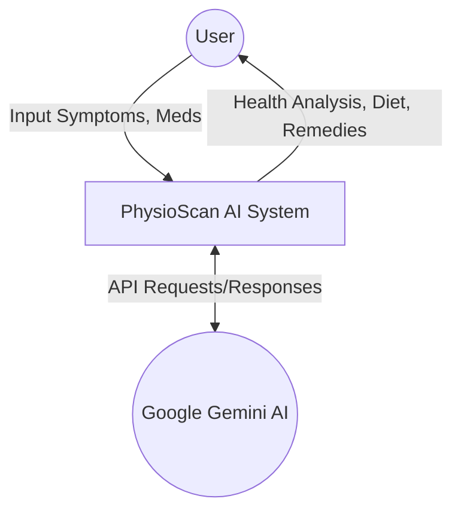
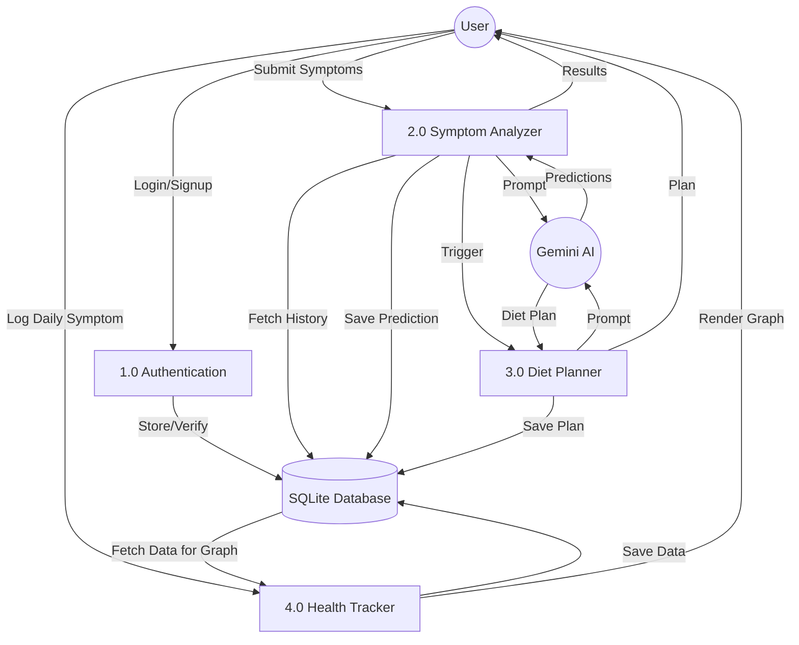

# Data Flow Diagram (DFD) - Level 0 & Level 1

## Level 0 (Context Diagram)

```mermaid
graph TD
    User((User)) -->|Input Symptoms, Meds| System[PhysioScan AI System]
    System -->|Health Analysis, Diet, Remedies| User
    System <-->|API Requests/Responses| GeminiAPI((Google Gemini AI))
```

## Level 1

```mermaid
graph TD
    User((User)) -->|Login/Signup| Auth[1.0 Authentication]
    Auth -->|Store/Verify| DB[(SQLite Database)]
    
    User -->|Submit Symptoms| Analyzer[2.0 Symptom Analyzer]
    Analyzer -->|Fetch History| DB
    Analyzer -->|Prompt| GeminiAPI((Gemini AI))
    GeminiAPI -->|Predictions| Analyzer
    Analyzer -->|Save Prediction| DB
    Analyzer -->|Results| User
    
    Analyzer -->|Trigger| Diet[3.0 Diet Planner]
    Diet -->|Prompt| GeminiAPI
    GeminiAPI -->|Diet Plan| Diet
    Diet -->|Save Plan| DB
    Diet -->|Plan| User
    
    User -->|Log Daily Symptom| Tracker[4.0 Health Tracker]
    Tracker -->|Save Data| DB
    DB -->|Fetch Data for Graph| Tracker
    Tracker -->|Render Graph| User
```
