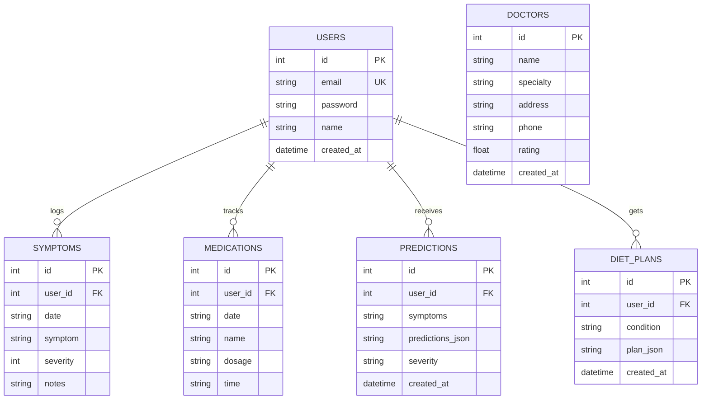

# Entity-Relationship (ER) Diagram

```mermaid
erDiagram
    USERS {
        int id PK
        string email UK
        string password
        string name
        datetime created_at
    }
    
    SYMPTOMS {
        int id PK
        int user_id FK
        string date
        string symptom
        int severity
        string notes
    }
    
    MEDICATIONS {
        int id PK
        int user_id FK
        string date
        string name
        string dosage
        string time
    }
    
    PREDICTIONS {
        int id PK
        int user_id FK
        string symptoms
        string predictions_json
        string severity
        datetime created_at
    }
    
    DIET_PLANS {
        int id PK
        int user_id FK
        string condition
        string plan_json
        datetime created_at
    }
    
    DOCTORS {
        int id PK
        string name
        string specialty
        string address
        string phone
        float rating
        datetime created_at
    }

    USERS ||--o{ SYMPTOMS : "logs"
    USERS ||--o{ MEDICATIONS : "tracks"
    USERS ||--o{ PREDICTIONS : "receives"
    USERS ||--o{ DIET_PLANS : "gets"
```
